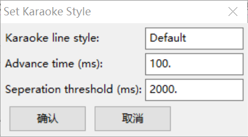

# Set Karaoke Style

Aegisub自动设置卡拉OK双行字幕样式插件。

将每行字幕交替设置形如`K1`/`K2`的样式。若不同行的字幕的时间相互重叠（对应歌曲中多句歌词同时唱的情况），排在后面的字幕行的样式会设置成`K3`/`K4`，若有字幕和这两层都重叠则依此类推。

## 用法

1. 下载源码并解压，将`set-karaoke-style.lua`复制到Aegisub安装目录下的`automation/autoload`目录中。
2. 对打好K轴的字幕文件，运行`Set Karaoke Style`自动化插件，输入K轴对应的的样式名称并运行。

### 参数说明

- Advance time：默认情况下上下两行歌词形成连续交替出现的序列，对于这样的序列的首行歌词，使字幕出现时间提前于歌曲播放到这行歌词的时间。
- Seperation threshold：当前后两行歌词相隔时间超过这个阈值时，下一行歌词不在紧随上一行歌词出现，而是开启一个新的序列。